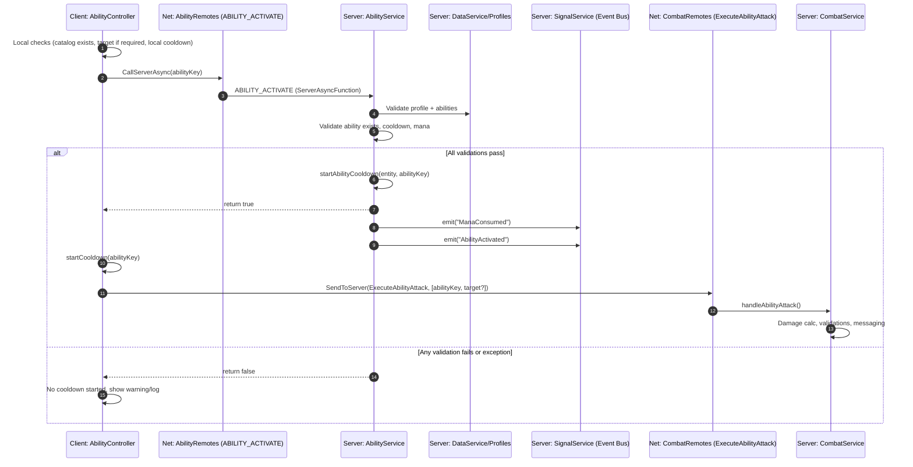

Quick tags: event-bus, ability-activation, networking, rbxts-net, server-async-function, client-to-server-event, cooldown, mana, validation, rate-limit, combat

This document explains how an ability activation request travels across client, network remotes, server services, and inter-service signals. It covers both success and failure pathways and lists the exact files, event names, and event types involved.

## Event Catalog (Files • Event Names • Types)

- Ability Activation Request
	- File: `src/shared/network/ability-remotes.ts`
	- Event name: `SIGNAL_KEYS.ABILITY_ACTIVATE`
	- Event type: `Definitions.ServerAsyncFunction<(abilityKey: AbilityKey) => boolean>`
	- Server handler: `src/server/services/ability-service.ts` → `initializeRemotes()` → `SetCallback`

- Ability Attack Execution (follow-up after successful activation)
	- File: `src/shared/network/combat-remotes.ts`
	- Event name: `ExecuteAbilityAttack`
	- Event type: `Definitions.ClientToServerEvent<[abilityKey: string, target?: SSEntity]>()`
	- Server handler: `src/server/services/combat-service.ts` → `setupNetworkConnections()` → `Connect` → `handleAbilityAttack`

- Inter-Service Signals (server-side event bus)
	- Emitted by: `src/server/services/ability-service.ts`
	- Signal: `ManaConsumed` (resource tracking)
	- Signal: `AbilityActivated` (analytics/telemetry)

## High-Level Sequence (Success Path)



## Detailed Flow With Outcomes

1) Client pre-checks (AbilityController)
	 - File: `src/client/controllers/AbilityController.ts`
	 - Steps:
		 - Look up `AbilityCatalog[abilityKey]` (fail if undefined).
		 - If `requiresTarget`, acquire target (locked or from mouse), else fail.
		 - If locally tracked cooldown active, fail early.

2) Network request (AbilityRemotes)
	 - File: `src/shared/network/ability-remotes.ts`
	 - Type: `ServerAsyncFunction<(abilityKey: AbilityKey) => boolean>`
	 - Contract: returns `true` only if server accepted activation and started cooldown.

3) Server validation and activation (AbilityService)
	 - File: `src/server/services/ability-service.ts`
	 - Entry: `initializeRemotes()` → `SetCallback((player, abilityKey) => boolean)`
	 - Rate-limiting: window ≈ 0.15s per player; on hit, returns `false`.
	 - `validateAbility(player, abilityKey)` checks:
		 - Profile exists in `DataService`.
		 - Ability exists in `AbilityCatalog` and is present in player profile.
		 - Not on server-side cooldown.
		 - Has sufficient resources (mana).
	 - On success:
		 - `startAbilityCooldown(entity, abilityKey)`
		 - Invoke optional `OnStartSuccess` callback from catalog (if defined)
		 - Emit `ManaConsumed` and `AbilityActivated` via `SignalService`
		 - Return `true`

4) Client follow-up and combat execution
	 - File: `src/client/controllers/AbilityController.ts`
	 - If `CallServerAsync` returned `true`:
		 - `startCooldown(abilityKey)` locally for UI feedback
		 - Send `ExecuteAbilityAttack` via `CombatRemotes` with optional `target`
	 - Server (`CombatService`) receives and performs damage handling, messaging, and signals.

## Failure Matrix (Common Failure Points)

Client-side early failures
- F01 Unknown ability key (no catalog entry)
- F02 Missing required target
- F03 Local cooldown active (UI timer not ready)

Server-side ABILITY_ACTIVATE rejections
- F04 Rate limited (request window 0.15s)
- F05 Missing player profile (`DataService.GetProfile` undefined)
- F06 Ability not found in profile data
- F07 Ability on server cooldown for entity
- F08 Insufficient mana for cost
- F09 Invalid character entity (character not an `SSEntity`)
- F10 Exception thrown during `handleAbilityStart` (safe `false` return)

Post-activation combat rejections (ExecuteAbilityAttack)
- C01 Target invalid or self-attack (unless heal-type ability)
- C02 Ability not damage-capable (`baseDamage` undefined or ≤ 0)
- C03 Missing required target for single-target abilities

Note: Ability catalog provides `OnStartSuccess`/`OnEnd` callbacks. `OnStartFailure` exists in the metadata type but is not invoked by `AbilityService` at this time.

## API “Contracts” Summary

- ABILITY_ACTIVATE
	- File: `src/shared/network/ability-remotes.ts`
	- Type: `ServerAsyncFunction<(abilityKey: AbilityKey) => boolean>`
	- Input: `abilityKey`
	- Output: `boolean` (`true` when server accepted and started cooldown)

- ExecuteAbilityAttack
	- File: `src/shared/network/combat-remotes.ts`
	- Type: `ClientToServerEvent<[abilityKey: string, target?: SSEntity]>`
	- Input: `abilityKey`, optional `target`
	- Output: none (fire-and-forget; effects are visible via separate events/messages)

## Guardrails and Validation Notes

- Network typing follows @rbxts/net rules: ServerAsyncFunction must return raw types (no Promise wrappers).
- Always re-validate Instances and optional lookups after yields; server-side checks are authoritative.
- Rate limits protect against spam; client should still throttle UI to avoid poor UX.
- See `reference/validation-matrix.md` and `reference/api-quirks.md` before editing remotes or validations.

## Flowchart — Success vs Failure

```mermaid
flowchart TD
A[Client: activateAbility(abilityKey)] --> B{Catalog entry exists?}
B -- No --> F01[Fail: Unknown ability]
B -- Yes --> C{Requires target?}
C -- Yes --> C1{Target acquired?}
C1 -- No --> F02[Fail: Missing target]
C1 -- Yes --> D
C -- No --> D{Local cooldown ready?}
D -- No --> F03[Fail: Local cooldown]
D -- Yes --> E[CallServerAsync(ABILITY_ACTIVATE)]
E --> G{Server validations}
G -->|Rate limit| F04[Fail]
G -->|No profile| F05[Fail]
G -->|Not in profile| F06[Fail]
G -->|On cooldown| F07[Fail]
G -->|Insufficient mana| F08[Fail]
G -->|Invalid entity| F09[Fail]
G -->|Exception| F10[Fail]
G -->|All pass| H[Server starts cooldown + emits signals]
H --> I[Client starts local cooldown]
I --> J[Send ExecuteAbilityAttack]
J --> K{Combat validations}
K -->|Invalid target/self| C01[Combat Fail]
K -->|Not damage ability| C02[Combat Fail]
K -->|Missing target| C03[Combat Fail]
K -->|OK| L[Damage handling + messages]
```

## References (Code Pointers)

- Client
	- `src/client/controllers/AbilityController.ts` — `activateAbility`, `startCooldown`, targeting helpers

- Shared Network
	- `src/shared/network/ability-remotes.ts` — `AbilityRemotes` (ABILITY_ACTIVATE)
	- `src/shared/network/combat-remotes.ts` — `CombatRemotes` (ExecuteAbilityAttack)
	- `src/shared/keys/event-keys.ts` — `SIGNAL_KEYS`

- Server
	- `src/server/services/ability-service.ts` — `initializeRemotes`, `validateAbility`, `handleAbilityStart`, `startAbilityCooldown`
	- `src/server/services/combat-service.ts` — `setupNetworkConnections`, `handleAbilityAttack`

---

Tags: event-bus, ability-activation, networking, rbxts-net, server-async-function, client-to-server-event, cooldown, mana, validation, rate-limit, combat

